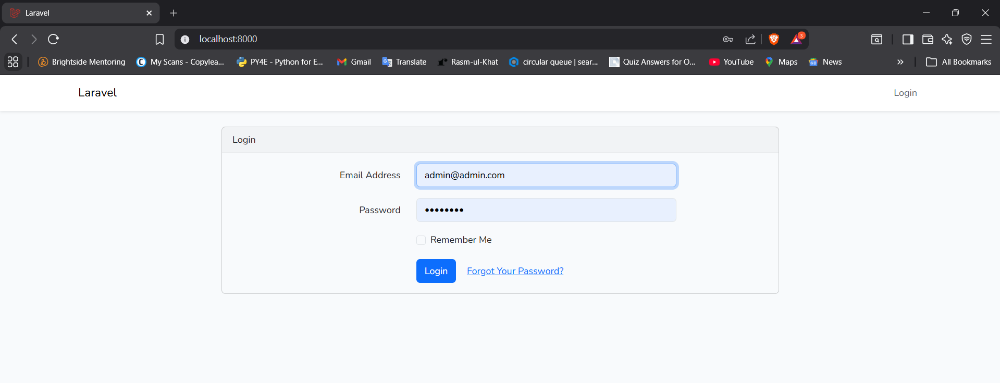
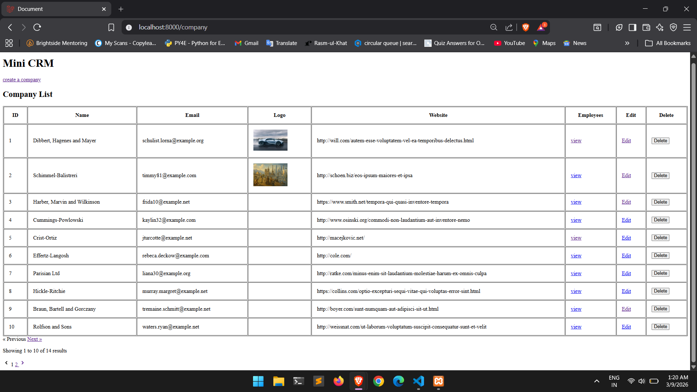
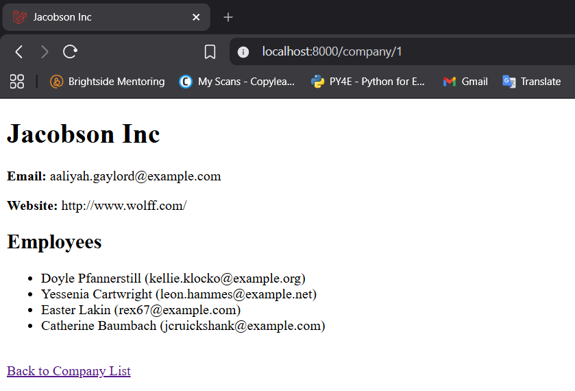
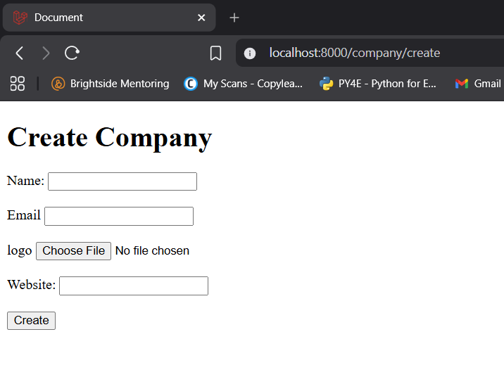
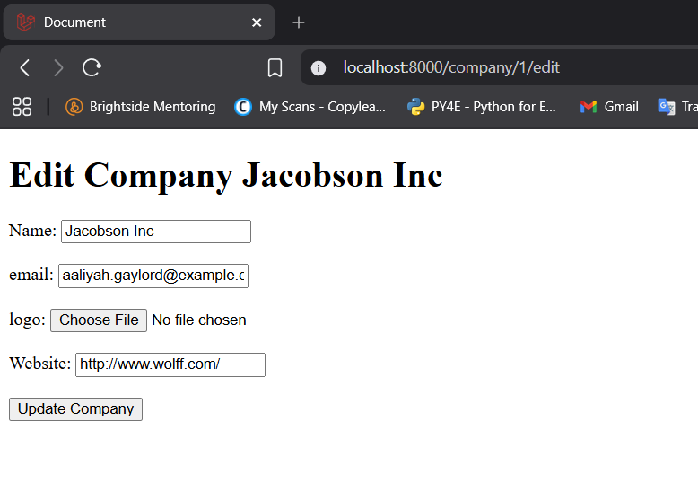
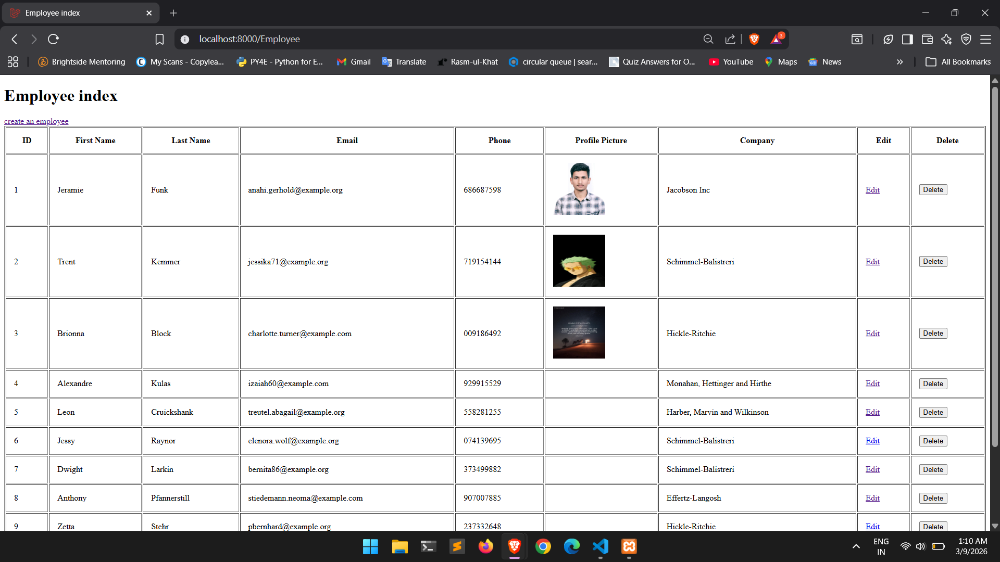
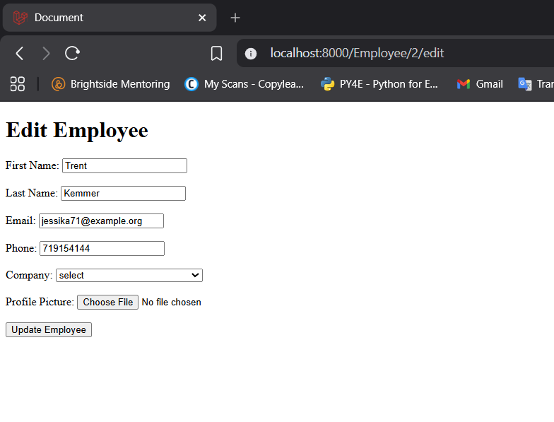
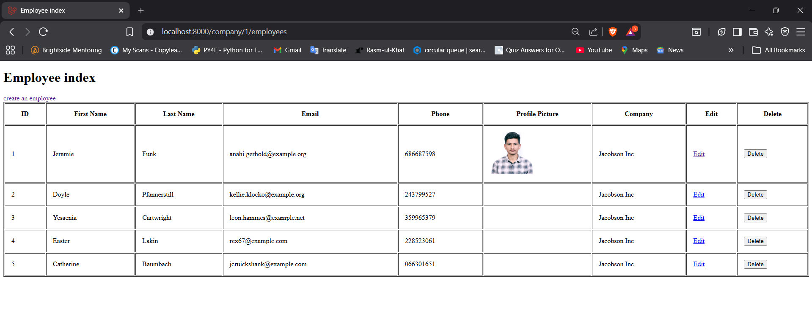
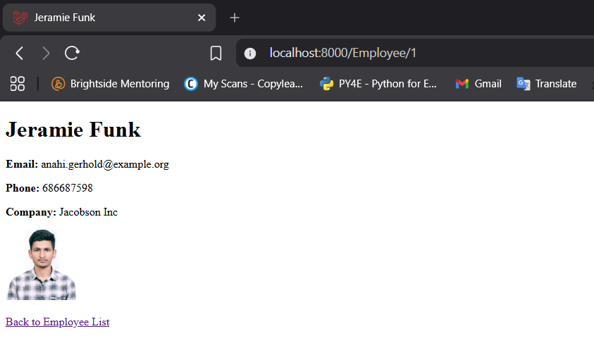
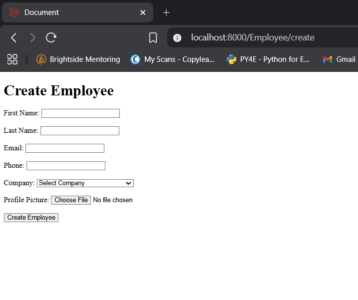

# Mini CRM (Laravel Practical Assignment)

Very small Laravel app for the practical assignment: manage **Employees** linked to **Companies**.

## Features

-   Login-based access (registration disabled)

    -   {username: admin@admin.com , password: password}

-   Employees: list, create, edit, delete
-   Companies: used as a dropdown when creating/editing employees

## Requirements

-   PHP + Composer
-   MySQL (XAMPP works)
-   Node.js + npm (Vite assets)

## Setup (local)

1. `composer install`
2. Copy `.env` and set `DB_*`
3. `php artisan key:generate`
4. `php artisan migrate`
5. `npm install`
6. `npm run dev` (or `npm run build`)

## Run

-   `php artisan serve` then open `http://127.0.0.1:8000`
-   If using Apache/XAMPP, point your site/document root to `public/`
-   seed the authentication using
    php artisan migrate:fresh --seed

## project structre

# Project Structure

```
mini-crm/
├── app/
│   ├── Http/
│   │   └── Controllers/
│   │       ├── CompanyController.php
│   │       ├── EmployeeController.php
│   │       └── HomeController.php
│   └── Models/
│       ├── Company.php
│       ├── Employee.php
│       └── User.php
├── database/
│   ├── factories/
│   └── migrations/
├── resources/
│   └── views/
│       ├── Company/
│       │   ├── create.blade.php
│       │   ├── edit.blade.php
│       │   ├── index.blade.php
│       │   └── show.blade.php
│       └── Employee/
│           ├── create.blade.php
│           ├── edit.blade.php
│           └── index.blade.php
└── routes/
    └── web.php
```

## App URLs

-   Login: `/`
-   Home: `/home` or '/company'

-   Companies: `/company`
-   Employees: `/Employee`

-   create employee: '/Employee/create'
-   create company: '/company/create'

## Notes

-   If you can’t log in, create a user record in the `users` table (registration is disabled).

For demonstration purpose , populate the database using factory

1]populate companies:

1. run php artisan tinker
   2)run App\Models\Company::factory(15)->create(); //this will create 15 company

2]populate employees:

1. run php artisan tinker
2. run $companies = \App\Models\Company::all(); //get all companies
3. run \App\Models\Employee::factory(50)->create(['company_id' => fn() => $companies->random()->id]); \\Create 50 employees, assigning each to a random company from the list

Now in the company table, you can create a new company from create button. you can edit the company, images are not uploaded by default but you can upload them by eddit buttton . at last you can delete the company using delete button.
thus CRUD functionality is implemented in this mini-crm project.
same for employees.

employee belongs to a company and company has many employees.If we delete a company then all the employees for that company will also be deleted.

All these RESTful methods are implemented:
o index
-/company
-/Employee shows the index page

o create
-/company/create
-/Employee/create

o store

o show
-/company/{id}
-/Employee/{id}

o edit
-/company/{id}/edit
-/Employee/{id}/edit

o update

o Destroy
-/company/{id}/destroy
-/Employee/{id}/destroy












